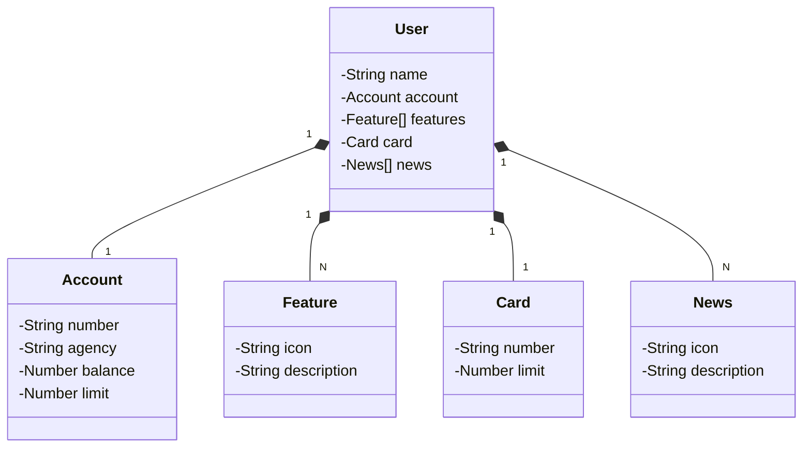

# API Rest With Spring

Java API RESTful desenvolvida para prática do framework Spring.

## Principais Tecnologias
- **Java 21**: Última versão LTS da linguagem Java, que oferece recursos avançados para desenvolvimento de aplicativos web;
- **Spring Boot 3.4.5**: A mais nova versão do Spring Boot, que maximiza a produtividade do desenvolvedor por meio de sua poderosa premissa de autoconfiguração;
- **Spring Data JPA**: Ferramenta para simplificar a camada de acesso aos dados, facilitando a integração com bancos de dados SQL;
- **OpenAPI (Swagger)**: Para criação de uma documentação de API eficaz e fácil de entender usando a OpenAPI (Swagger), perfeitamente alinhada com a alta produtividade que o Spring Boot oferece;
- **Railway**: Facilita o deploy e monitoramento de soluções na nuvem, além de oferecer diversos bancos de dados como serviço e pipelines de CI/CD.

O Figma foi utilizado para a abstração do domínio desta API, sendo útil na análise e projeto da solução.

## Diagrama de Classes (Domínio da API)

